# 📊 PL-300 Lab 1: Configuración del entorno local de laboratorio (Setup local lab environment)

**Fecha:** Septiembre 2026
**Certificación:** PL-300 Microsoft Power BI Data Analyst

---

## 🎯 Objetivo de la Práctica
El objetivo de este laboratorio es preparar nuestra máquina local (o máquina virtual) con todas las herramientas, bases de datos y archivos necesarios para poder ejecutar con éxito el resto de los laboratorios del curso PL-300. 

A continuación, se detallan los pasos realizados, acompañados de sus respectivas evidencias.

---

## 🛠️ Paso 1: Descarga y preparación de los archivos del curso

Para realizar los laboratorios de Microsoft, necesitamos los conjuntos de datos, logos y archivos base de Power BI. 

**Explicación del proceso:**
1. Me dirigí al repositorio oficial de GitHub de Microsoft Learning para el PL-300.
2. Descargué el código fuente (archivo AllfilesDownload.zip).

3. Extraje la carpeta de recursos. Según las instrucciones oficiales, es una buena práctica alojar estos archivos en una ruta corta para evitar errores de longitud de ruta, por lo que creé la estructura .

> **💡 Ejemplo práctico:** En la carpeta `Allfiles` ahora dispongo de subcarpetas críticas como `Demo`, `Lab` y `MySolution` que usaré en las siguientes prácticas para cargar datos de Excel, CSV o conectarme a carpetas.

*(Evidencia: Captura del Explorador de archivos de Windows mostrando la ruta `C:\Downoads\Allfiles` con las carpetas descomprimidas).*

<!-- 📸 INSTRUCCIÓN PARA TI: Arrastra tu imagen aquí o usa la sintaxis  -->
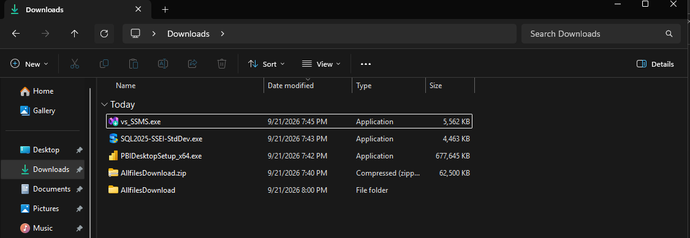

---

## 📈 Paso 2: Instalación de Power BI Desktop

Power BI Desktop es la herramienta principal de desarrollo para modelado y creación de informes.

**Explicación del proceso:**
1. Accedí a la **Microsoft Store** (recomendado para recibir actualizaciones automáticas mensuales) y busqué "Power BI Desktop".
2. Realicé la instalación estándar sin modificar las opciones por defecto.
3. Una vez instalado, abrí la aplicación para comprobar que arranca correctamente y que la interfaz de usuario está lista para trabajar. 

> **💡 Detalle de configuración:** Para alinear mi entorno con los laboratorios, me aseguré de que las opciones de "Carga de datos" en la configuración global estén según los estándares del curso (por ejemplo, verificar si el autodetectado de relaciones está activo o inactivo, según lo pida el instructor).

*(Evidencia: Captura de pantalla con Power BI Desktop abierto en la pantalla de inicio y en un lienzo en blanco).*

<!-- 📸 INSTRUCCIÓN PARA TI: Arrastra tu imagen aquí o usa la sintaxis  -->
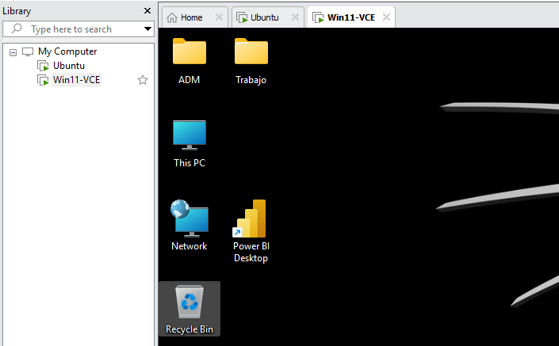
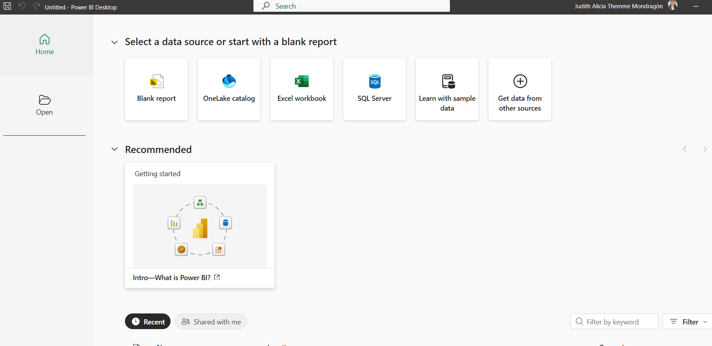

---

## ☁️ Paso 3: Configuración de la Cuenta de Microsoft 365 Developer (Organizacional)

Para la fase de distribución de informes (Publicar en el Servicio Power BI, crear áreas de trabajo, configurar seguridad RLS en la nube), una cuenta personal de Gmail o Outlook no es válida.

**Explicación del proceso:**
1. Si no contaba con una cuenta educativa o corporativa proporcionada por el aula, procedí a registrarme en el programa **Microsoft 365 Developer**.
2. Esto me otorgó un tenant (entorno) gratuito con licencias E5 y un correo con dominio `.onmicrosoft.com`.
3. Inicié sesión con esta cuenta en la esquina superior derecha de Power BI Desktop.

> **💡 Ejemplo práctico:** Tener esta sesión iniciada me permitirá hacer clic en "Publicar" más adelante y que el `.pbix` viaje directamente a `app.powerbi.com` bajo mi entorno de pruebas.

*(Evidencia: Captura de Power BI Desktop donde se vea tu nombre de usuario o iniciales en la esquina superior derecha, confirmando que has iniciado sesión).*

<!-- 📸 INSTRUCCIÓN PARA TI: Arrastra tu imagen aquí o usa la sintaxis  -->
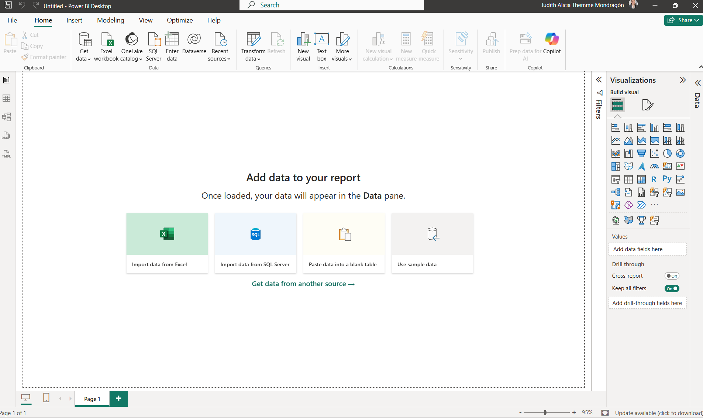

---

## 🗄️ Paso 4: Instalación de SQL Server Database Engine (Localhost)

Varios ejercicios del curso simulan la conexión a bases de datos relacionales corporativas (DirectQuery o Import mode) utilizando SQL Server.

**Explicación del proceso:**
1. Descargué la edición **Developer** de SQL Server, la cual es gratuita para entornos de desarrollo y pruebas.
2. Ejecuté el instalador usando la opción "Básica" o personalizada asegurándome de instalar únicamente el **Database Engine** (Motor de base de datos).
3. Configuré la instancia local (generalmente accesible bajo el nombre `localhost`).

> **💡 Ejemplo práctico:** Gracias a esto, cuando en Power BI elija la opción "Obtener datos -> SQL Server", podré escribir `localhost` y conectarme a las bases de datos de prueba (como *AdventureWorks*) que se usarán a lo largo del curso.

*(Evidencia: Captura de pantalla del Centro de instalación de SQL Server indicando "Instalación completada correctamente" o de una herramienta como SSMS conectada a localhost).*

<!-- 📸 INSTRUCCIÓN PARA TI: Arrastra tu imagen aquí o usa la sintaxis  -->

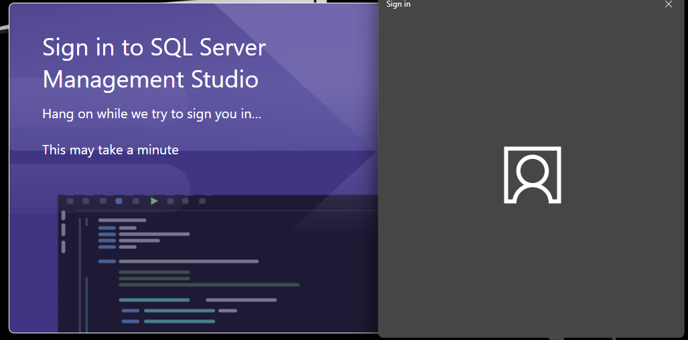
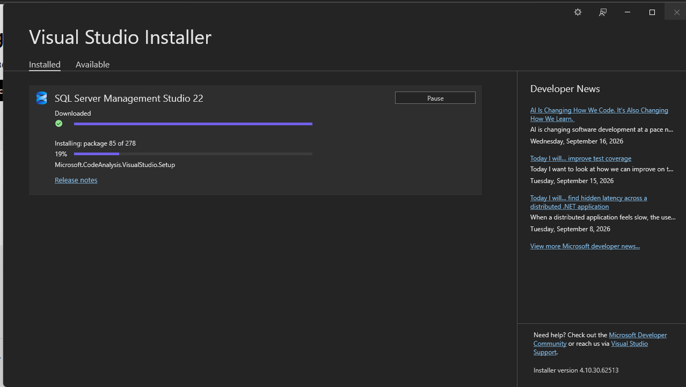
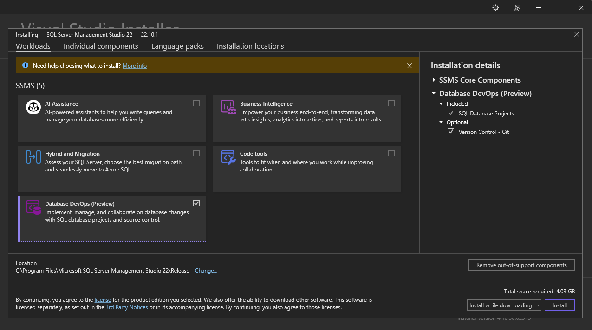
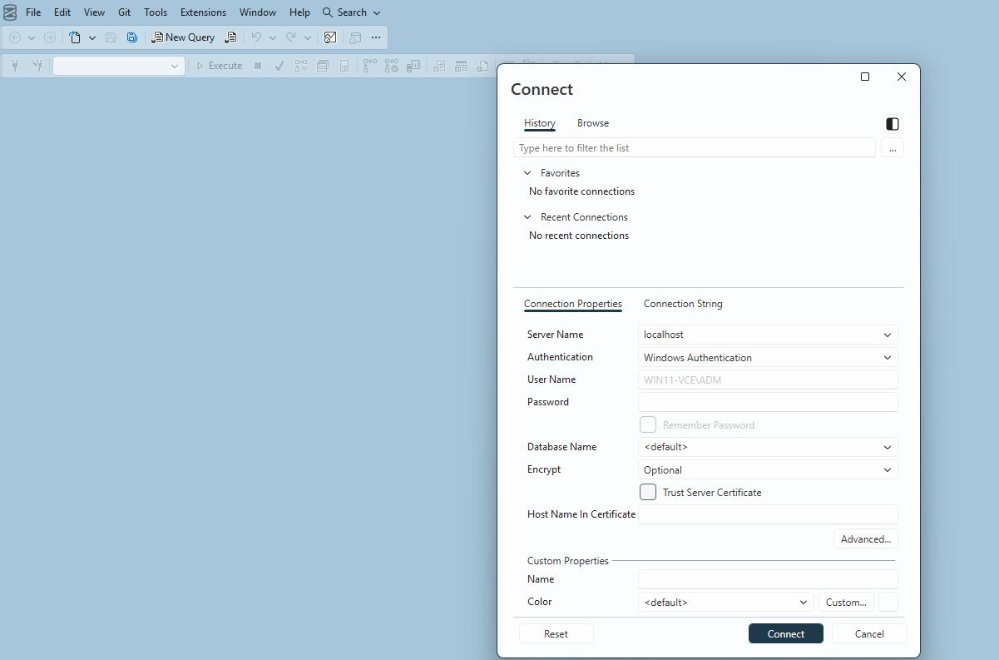
---
**Restore Database:**
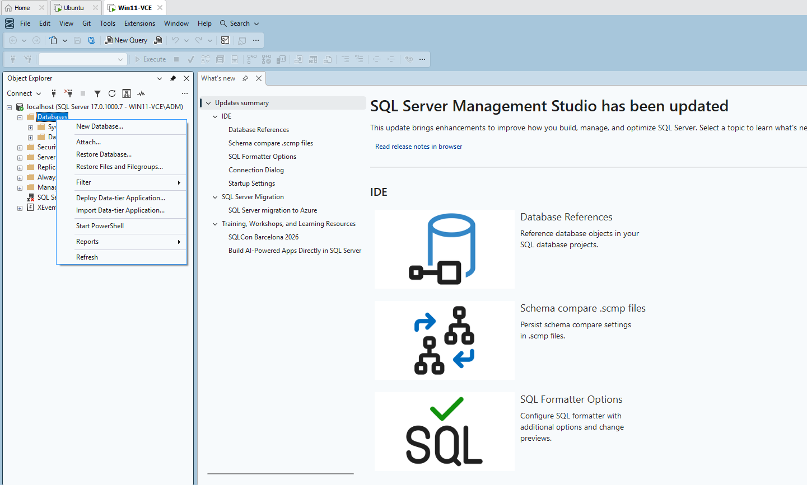
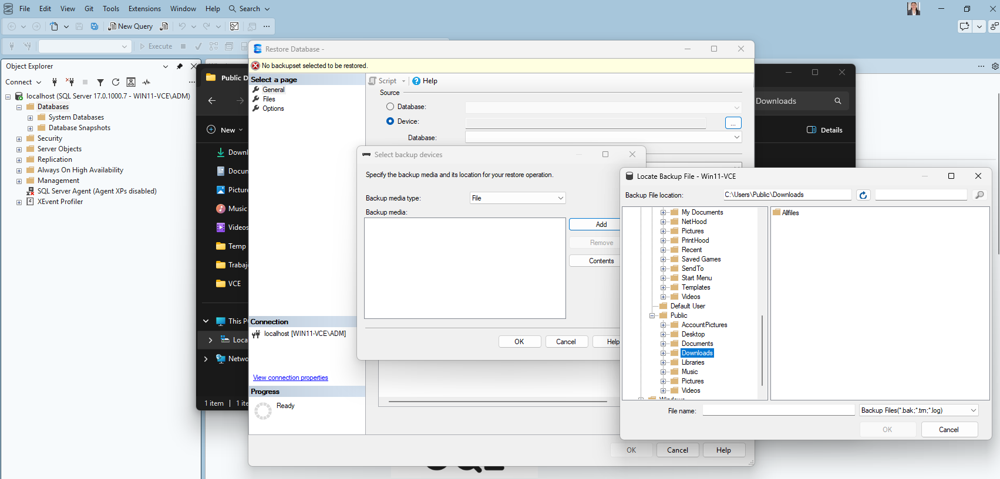
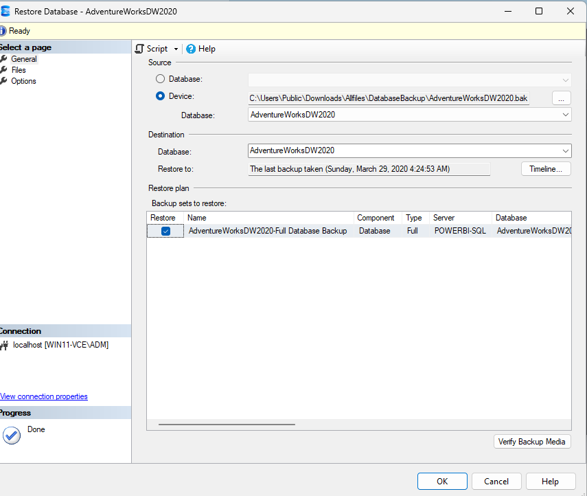
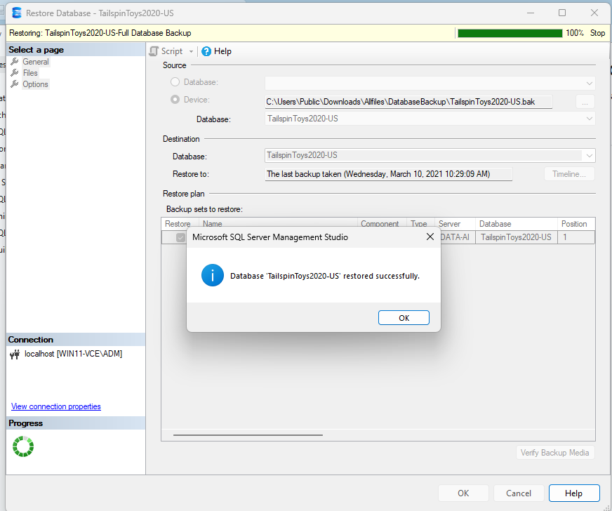
---
**Bases de datos restauradas de backup:**
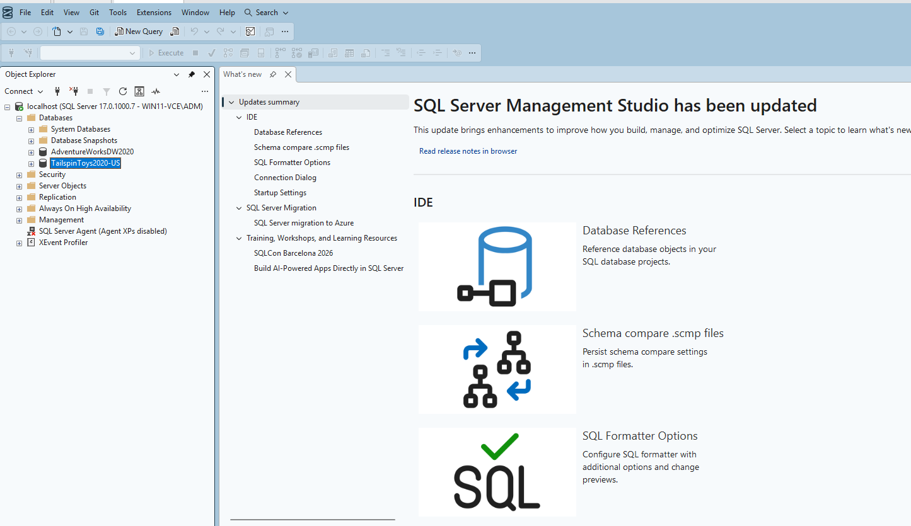

---

## ✅ Conclusión de la Práctica
Con estos 4 pasos completados, la máquina (virtual o física) cumple con los prerrequisitos de *software* y *arquitectura de archivos* del itinerario oficial. El entorno es ahora estable y totalmente compatible para iniciar la importación y el modelado de datos en los siguientes laboratorios del PL-300.